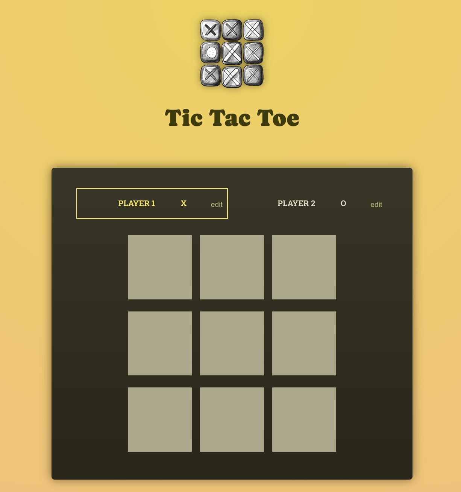

# 🎮 Tic Tac Toe Game

A fun and interactive **Tic Tac Toe** game built with **React**!  
Challenge your friends, track moves, and see who wins 

---

## 🌐 Live Demo

🔗 **[Play Now](https://reeehaan.github.io/tic-tac-toe-game/)**  

---

## 🧩 Features

✅ Two-player gameplay (Player X vs Player O)  
✏️ Editable player names  
🧠 Automatic winner and draw detection  
📜 Move history log  
🔁 Restart game anytime  
⚡ Built with modern React (Hooks & Components)  


---

## 🖼️ Preview

Here’s how the game looks 👇  

<p align="center">
  
</p>

---

## 🛠️ Tech Stack

- **React.js** 
- **JavaScript (ES6+)** – Logic & interactivity  
- **HTML5 / CSS3** – Layout & styling  
- **GitHub Pages** – Hosting & deployment  

---

## 🧠 How the Game Works

- Each player takes turns marking a cell in the 3×3 grid.  
- The app checks all possible **winning combinations** (rows, columns, diagonals).  
- If a player has three of their marks in a line — 🎉 they win!  
- If all cells are filled with no winner → it's a **draw**.  
- Players can rename themselves and restart anytime.

---

## ⚙️ Local Development Setup

1. **Clone this repository**
   ```bash
   git clone https://github.com/reeehaan/tic-tac-toe-game.git
   cd tic-tac-toe-game
2. **Run the app locally**
   ```bash
   npm install
   npm run dev
